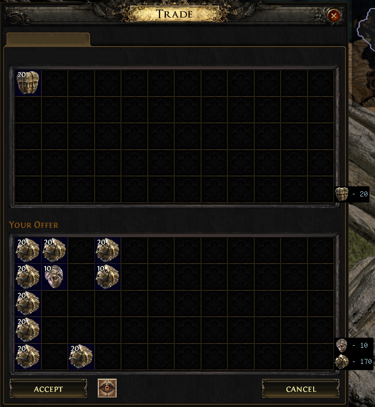
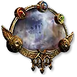

# Tradie
This plugin is a fork from the original [Tradie](https://github.com/TiuDerca/Tradie), updated to work on PoE2.

Note that even though the plugin is a fork from the original, it has been re-written and the handling of logic has been changed.
Also, there are features that I neither implemented nor plan to implement.

## Preview

## Features
- **Hover Everything**: Hover all their items by clicking on the icon near the ACCEPT button.
- **Currency Count**: Shows the amount of currency each player has in the trade.

## Table of Whitelisted Items (and their icons)

| Item | Icon |
| --- | --- |
| Exalted Orb |  |
| Chaos Orb |  |
| Divine Orb |  |
| Mirror of Kalandra |  |

### How to add more items to the whitelist
Not
- Open pull request editing:
  - README.md and add the item to the table above
  - _whiteListedPaths variable in Core.cs and add the item to the list
  - Upload the icon to the images folder
- Open an issue with the following informations [got from here](https://poe2db.tw/us/Currency_Exchange):
  - Link to the item (poe2db)
  - Type
  - Icon.png (upload the icon)